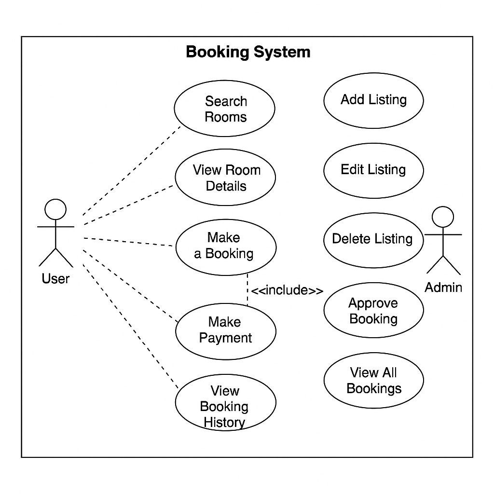

# Requirement Analysis in Software Development

This repository explains the process and significance of Requirement Analysis in software development. It breaks down the key concepts, types of requirements, and visual examples such as use case diagrams.

## What is Requirement Analysis?

Requirement Analysis is the process of identifying, documenting, and managing the needs and expectations of stakeholders for a software system. It ensures that developers and clients are aligned on what the system should do.

It is a crucial phase in the Software Development Life Cycle (SDLC) as it lays the foundation for all future development. Clear and accurate requirements reduce the risk of project failure and scope creep.

## Why is Requirement Analysis Important?

- **Reduces Miscommunication**: It ensures that all stakeholders have a shared understanding of the system’s purpose and features.
- **Prevents Scope Creep**: Well-defined requirements help in maintaining project boundaries.
- **Improves Quality**: Clear requirements lead to better design, development, and testing processes, resulting in higher-quality software.

## Key Activities in Requirement Analysis

- **Requirement Gathering**: Collecting information from stakeholders through interviews, surveys, and existing documentation.
- **Requirement Elicitation**: Clarifying and discovering hidden needs through detailed discussions and workshops.
- **Requirement Documentation**: Writing down all requirements in a structured, understandable format.
- **Requirement Analysis and Modeling**: Analyzing relationships, dependencies, and conflicts, often through diagrams or models.
- **Requirement Validation**: Confirming with stakeholders that the documented requirements are complete and correct.

## Types of Requirements

### Functional Requirements
These describe *what* the system should do.
Examples for a booking system:
- Users can search for available rooms.
- Admins can add or remove listings.
- Users can make a booking and receive confirmation emails.

### Non-functional Requirements
These describe *how* the system should behave.
Examples:
- The system should load pages in under 2 seconds.
- The booking service must be available 99.9% of the time.
- Data must be encrypted during transmission.
## Use Case Diagrams

Use Case Diagrams show how users interact with the system. They help identify system boundaries and functionalities.

## Acceptance Criteria

Acceptance Criteria define the conditions that must be met for a feature to be accepted by the client. They ensure clarity and completeness for developers and testers.

**Example for Checkout Feature**:
- The system must display the total price before final confirmation.
- Users must be able to apply discount codes.
- A confirmation email should be sent within 5 minutes after booking.

Acceptance Criteria help maintain clear expectations and reduce rework.
